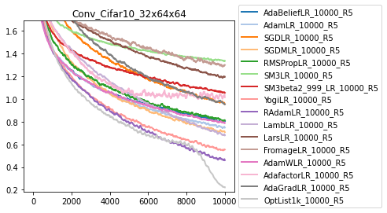

Optimizer Baselines
==================

Evaluating optimizers is notoriously difficult as optimizer performance varies
greatly across different tasks, and which hyper parameters are used.
Never the less, when training learned optimizers, we needed to evaluate them!
To that end, we have built, a system as well as a large
set of baseline of precomputed optimizers on a variety of tasks.

Distribution of Tasks
--------------------
We define a set of "fixed" tasks which are functions which produce `Task` instances and which we evaluate performance of optimizers on.
These tasks are named with the same name as the function. For example `ImageMLP_Cifar10_8_Relu32<https://github.com/google/learned_optimization/blob/09a830f098eb372fc7ddfc147289386442347d06/learned_optimization/tasks/fixed/image_mlp.py#L111I>`_ is a task which involves training a tiny MLP.
The code for all tasks can be found at `learned_optimization/tasks/fixed`.
Each `Task` defines a dataset, a batchsize, a loss function and a model architecture. See (:doc:`tasks` for full info.)

Hyper Parameter Sets
--------------------
Given one of these tasks we can evaluate some set of baseline optimizers on it.
These sets are defined in `learned_optimization/baselines/hparam_sets.py<https://github.com/google/earned_optimization/blob/main/learned_optimization/baselines/hparam_sets.py>`_ and define a list of gin configurations as well as paths with which to save results to.

There are numerous different baselines, each of which defines hyper parameters for the optimizer, (e.g. learning rates), number of random seeds, and details about how frequently to perform evaluations over the course of training.

Training one task
-----------------
To evaluate an hparam set, one needs to evaluates each configuration.
These configurations get passed into an inner-training script `learned_optimization/baselines/run_trainer.py<https://github.com/google/learned_optimization/blob/main/learned_optimization/baselines/run_trainer.py>`_
which then write out the results.

We release a folder with a large number of evaluations at `gs://gresearch/learned_optimization/opt_curves/`.
To run your own, by default, these will be located at the environment variable `LOPT_BASELINE_DIR`, or `~/lopt_baselines` by default.
Each individual run gets stored in a nested folder.

The raw files are in numpy's savez format, and can be loaded back.

.. code-block::

  import tensorflow as tf
  import numpy as np
  path = "gs://gresearch/learned_optimization/opt_curves/MLPMixer_ImageNet64_small16/Yogi_lr1e-05/10000_10_5_10/20220430_001348_8b9b03eb-b.curves"
  data ={k:v for k,v in np.load(tf.io.gfile.GFile(path, "rb")).items()}

Or you can leverage `learned_optimization.baselines.utils.load_baseline_results_from_dir` which globs the directory,
and loads all training curves.

Results from multiple trials: Archives
--------------------------------------
Often times we seek to look at results from multiple trials though.
The `AdamLR_10000_R5` hparam set, for example, runs 14 learning rates, with 5 random seeds each meaning 70 trials.
As these results are useful together, we provide utils to aggregate these 70 files into a single file.
These archives are created by `learned_optimization/baselines/run_archive.py<https://github.com/google/learned_optimization/blob/main/learned_optimization/baselines/run_archive.py>`_ which is again configured by gin.
which then write out the results.

By default these are stored in the `LOPT_BASELINE_ARCHIVES_DIR` environment variable, or `~/lopt_baselines_archives`. 
We also provide a set of baselines for many tasks in `gs://gresearch/learned_optimization/opt_archives/`.

As before, these are simply numpy savez files, and can be loaded directly or with
`learned_optimization.baselines.load_archive` which takes a task name and a hparam set name.

Visualization of results
-----------------------

For ease of access, we have a simple function to visualize multiple different optimizers
on a given task. This function loads all the hparam sets, finds the best hyper parameter configuration across the set,
performs averages over the different random seeds, and then plots.

.. code-block::
  os.environ.update(LOPT_BASELINE_ARCHIVES_DIR="gs://gresearch/learned_optimization/opt_archives")

  from learned_optimization.baselines import vis
  opt_sets = [
              "AdaBeliefLR_10000_R5",
              "AdamLR_10000_R5",
              "SGDLR_10000_R5",
              "SGDMLR_10000_R5",
              "RMSPropLR_10000_R5",
              "SM3LR_10000_R5",
              "SM3beta2_999_LR_10000_R5",
              "YogiLR_10000_R5",
              "RAdamLR_10000_R5",
              "LambLR_10000_R5",
              "LarsLR_10000_R5",
              "FromageLR_10000_R5",
              "AdamWLR_10000_R5",
              "AdafactorLR_10000_R5",
              "AdaGradLR_10000_R5",
              "OptList1k_10000_R5",
  ]

  task_name = "Conv_Cifar10_32x64x64"
  vis.plot_tasks_and_sets(task_name, opt_sets, alpha_on_confidence=0.0)

Normalization of losses
--------------------------
One cannot directly aggregate performance / loss values across all the different tasks as the loss values mean different things (e.g. cross entropy loss vs mean square error).
Nevertheless, understanding aggregate performance is useful when evaluating optimizers.
As a solution to this, we have developed loss normalizers which can be used to normalize all losses to the same scales.
These normalizers themselves are based on performance measurements from different baselines.
See `learned_optimization/baselines/normalizers.py` for more info.