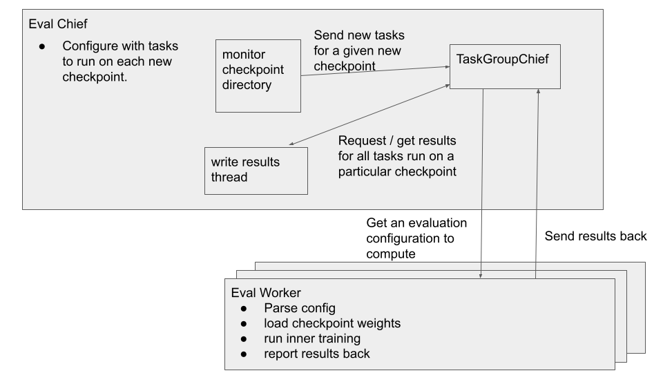

Continuous Eval
================

Meta-learning training can be an incredibly noisy process as one often meta-learns over randomly sampled tasks and these sampled tasks could have very different meta-objectives.
To get higher quality evaluation, as well as to evaluate performance on different
kinds of distributions of tasks (i.e. to test out of distribution generalization)
it is often useful to evaluate a suite of tasks on a single, fixed checkpoint/fixed meta-parameter value.
This is a bit tricky though as this can be very expensive -- in the case of learned
optimizers this requires training a number of different tasks a large number
of inner-steps.
To get faster evaluations, it is desirable to split up this computation and run it in
parallel across a number of machines.

This module is created to help with distributed evaluation of a given checkpoint
and is meant to be run alongside a meta-training job / meta-training cluster
so as to get stable evaluations while training. It interacts with a training
job by monitoring a directory for a new checkpoint and kicks evaluation jobs
off based on that.

We summarize the architecture in the figure below.

.. path to edit figure: https://docs.google.com/presentation/d/16zWe2ryUUcbWSBRhfYx7D5BwG9z1Mt-4BpWCOKmnais/edit?resourcekey=0-_if_-4xNYC5bgD1ZyN2Pmg#slide=id.p --->

There are 2 types of job: the eval chief and the eval worker.

Evaluation Chief
----------------

The evaluation chief is configured with a set of evaluations with which to run
a given checkpoint on. The chief then starts up a couple of threads.
First, there is a thread to monitor a given directory for a new checkpoint.
When a new checkpoint is found, we send this checkpoint as well as the list of
evaluations (e.g. different tasks) to evaluate on it to an instance of `TaskGroupChief`.
This is a task queue specifically structured to manage groups of tasks being evaluated on a single checkpoint.
A final thread monitors this task queue for finished groups of tasks and
writes the results out to tensorboard, and optionally the population controller
if one is using population based training

Evaluation configuration
------------------------

While it's possible to use similar infrastructure to pass around any kind of
configuration for an evaluation task, we opt to use `gin <https://github.com/google/gin-config>`_ -- in in particular
a set of gin bindings which specify the new task.
We find this very convenient, but it comes at the cost of complexity and global
state.

Evaluation Worker
------------------------

For a given evaluation chief, we run multiple evaluation workers. Each worker
is responsible for grabbing an evaluation to work on from the eval chief.
We first parse the evaluation configuration, load any weights (e.g. weights of
the learned optimizer), perform some inner-training procedure which does the
evaluation, and finally report the results back to the eval chief.
This loop repeats over and over again.
